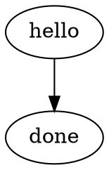

# Kiln MVP Implementation Plan

> **For agentic workers:** REQUIRED SUB-SKILL: Use superpowers:subagent-driven-development (recommended) or superpowers:executing-plans to implement this plan task-by-task. Steps use checkbox (`- [ ]`) syntax for tracking.

**Goal:** Build a local DAG orchestrator that runs shell-command workflows, tracks runs in SQLite, exposes logs and status via CLI, and posts a 15-minute Slack status report.

**Architecture:** `kiln` is a short-lived Python CLI. Workflows are DOT files in the repo. Runtime state is stored in SQLite under the user's data directory and log files live beside it. Cron drives scheduling and reporting; `kiln` does not run as a daemon.

**Tech Stack:** Python 3.13 stdlib (`argparse`, `sqlite3`, `subprocess`, `json`, `pathlib`, `urllib`, `unittest`), tmux, cron, Claude CLI fallback for Slack posting

---

## File Structure

- `pyproject.toml` — package metadata and console entry point
- `README.md` — operator-facing usage
- `src/kiln/cli.py` — argparse entry point and command dispatch
- `src/kiln/paths.py` — data directory, DB path, log root helpers
- `src/kiln/db.py` — schema creation and query helpers
- `src/kiln/dot.py` — constrained DOT parser
- `src/kiln/models.py` — simple dataclasses for workflow and node definitions
- `src/kiln/runtime.py` — run creation, node execution, retry logic
- `src/kiln/scheduler.py` — schedule registration, due checks, lock handling
- `src/kiln/reporting.py` — human status rendering and Slack payload construction
- `src/kiln/slack.py` — webhook transport plus Claude CLI fallback
- `tests/test_dot.py` — parser tests
- `tests/test_runtime.py` — execution and state persistence tests
- `tests/test_reporting.py` — status and Slack summary tests
- `workflows/sample.dot` — reference workflow
- `.codex/skills/kiln/SKILL.md` — agent usage contract
- `scripts/install_cron.sh` — helper that installs cron lines for tick and report

### Task 1: Project Skeleton And Packaging

**Files:**
- Create: `pyproject.toml`
- Create: `README.md`
- Create: `src/kiln/__init__.py`
- Create: `src/kiln/paths.py`
- Create: `src/kiln/models.py`
- Create: `workflows/sample.dot`

- [ ] **Step 1: Create package metadata**

```toml
[build-system]
requires = ["setuptools>=68"]
build-backend = "setuptools.build_meta"

[project]
name = "kiln"
version = "0.1.0"
description = "Minimal local DAG orchestrator"
requires-python = ">=3.13"

[project.scripts]
kiln = "kiln.cli:main"
```

- [ ] **Step 2: Add path helpers and data roots**

```python
from pathlib import Path

APP_DIR = Path.home() / ".local" / "share" / "kiln"
DB_PATH = APP_DIR / "kiln.db"
LOG_ROOT = APP_DIR / "logs"
LOCK_ROOT = APP_DIR / "locks"

def ensure_app_dirs() -> None:
    for path in (APP_DIR, LOG_ROOT, LOCK_ROOT):
        path.mkdir(parents=True, exist_ok=True)
```

- [ ] **Step 3: Add workflow dataclasses**

```python
from dataclasses import dataclass, field

@dataclass(frozen=True)
class NodeDef:
    node_id: str
    command: str
    cwd: str | None = None
    name: str | None = None
    deps: tuple[str, ...] = field(default_factory=tuple)
```

- [ ] **Step 4: Add a sample workflow**



- [ ] **Step 5: Commit**

```bash
git add pyproject.toml README.md src/kiln/__init__.py src/kiln/paths.py src/kiln/models.py workflows/sample.dot
git commit -m "feat: scaffold kiln package"
```

### Task 2: SQLite Schema And DOT Parsing

**Files:**
- Create: `src/kiln/db.py`
- Create: `src/kiln/dot.py`
- Create: `tests/test_dot.py`

- [ ] **Step 1: Write parser tests first**

```python
import unittest

from kiln.dot import parse_dot


class ParseDotTests(unittest.TestCase):
    def test_parses_nodes_and_edges(self) -> None:
        dot = '''
        digraph sample {
          first [command="echo first"];
          second [command="echo second", cwd="."];
          first -> second;
        }
        '''
        workflow = parse_dot(dot)
        self.assertEqual(set(workflow.nodes), {"first", "second"})
        self.assertEqual(workflow.nodes["second"].deps, ("first",))
```

- [ ] **Step 2: Run test to verify failure**

```bash
PYTHONPATH=src python3 -m unittest tests.test_dot -v
```

Expected: import failure for `kiln.dot`

- [ ] **Step 3: Implement schema setup and parser**

```python
def init_db(conn):
    conn.executescript(
        """
        create table if not exists workflows (...);
        create table if not exists schedules (...);
        create table if not exists runs (...);
        create table if not exists node_runs (...);
        """
    )
```

```python
NODE_RE = re.compile(r'^\s*(?P<id>[A-Za-z0-9_]+)\s*\[(?P<attrs>.+)\]\s*;\s*$')
EDGE_RE = re.compile(r'^\s*(?P<src>[A-Za-z0-9_]+)\s*->\s*(?P<dst>[A-Za-z0-9_]+)\s*;\s*$')
ATTR_RE = re.compile(r'([A-Za-z_]+)\s*=\s*"((?:[^"\\\\]|\\\\.)*)"')
```

- [ ] **Step 4: Re-run parser tests**

```bash
PYTHONPATH=src python3 -m unittest tests.test_dot -v
```

Expected: PASS

- [ ] **Step 5: Commit**

```bash
git add src/kiln/db.py src/kiln/dot.py tests/test_dot.py
git commit -m "feat: add db schema and dot parser"
```

### Task 3: Runtime Execution, Logs, And Retry

**Files:**
- Create: `src/kiln/runtime.py`
- Create: `tests/test_runtime.py`

- [ ] **Step 1: Write runtime tests first**

```python
import tempfile
import unittest
from pathlib import Path

from kiln.runtime import run_workflow


class RuntimeTests(unittest.TestCase):
    def test_run_workflow_records_success(self) -> None:
        with tempfile.TemporaryDirectory() as tmp:
            workflow_path = Path(tmp) / "sample.dot"
            workflow_path.write_text(
                'digraph sample { one [command="python3 -c \\"print(1)\\""]; }',
                encoding="utf-8",
            )
            result = run_workflow(workflow_path, trigger="manual", context={})
            self.assertEqual(result.status, "success")
```

- [ ] **Step 2: Run runtime test to verify failure**

```bash
PYTHONPATH=src python3 -m unittest tests.test_runtime -v
```

Expected: import failure for `kiln.runtime`

- [ ] **Step 3: Implement minimal runtime**

```python
process = subprocess.run(
    node.command,
    shell=True,
    cwd=node_cwd,
    text=True,
    stdout=log_handle,
    stderr=subprocess.STDOUT,
)
```

Rules:
- create a run row before node execution
- create a node run row per node
- topologically execute only ready nodes
- stop the workflow on first failure
- write each node log to `~/.local/share/kiln/logs/<run-id>/<node-id>.log`

- [ ] **Step 4: Add retry support and tests**

```python
def retry_run(run_id: str, from_failed: bool = False) -> RunResult:
    ...
```

Test at least:
- rerunning the whole workflow
- rerunning starting from the first failed node

- [ ] **Step 5: Re-run runtime tests**

```bash
PYTHONPATH=src python3 -m unittest tests.test_runtime -v
```

Expected: PASS

- [ ] **Step 6: Commit**

```bash
git add src/kiln/runtime.py tests/test_runtime.py
git commit -m "feat: add workflow runtime and retry"
```

### Task 4: CLI Surface, Status, Logs, And Scheduling

**Files:**
- Create: `src/kiln/cli.py`
- Create: `src/kiln/scheduler.py`
- Modify: `src/kiln/db.py`
- Modify: `tests/test_runtime.py`

- [ ] **Step 1: Add CLI tests or command smoke coverage**

```bash
PYTHONPATH=src python3 -m kiln.cli list
PYTHONPATH=src python3 -m kiln.cli run workflows/sample.dot
PYTHONPATH=src python3 -m kiln.cli status --json
```

Expected:
- `list` prints available workflows
- `run` returns a run id and status
- `status --json` emits valid JSON

- [ ] **Step 2: Implement command surface**

Commands:
- `run`
- `tick`
- `list`
- `status`
- `logs`
- `retry`
- `schedule add`

Use `argparse` subparsers and keep command handlers in small functions.

- [ ] **Step 3: Implement scheduler due checks**

```python
def should_run_now(cron_expr: str, now: datetime) -> bool:
    minute, hour, dom, month, dow = cron_expr.split()
    ...
```

Support only:
- `*`
- `*/N`
- exact numeric values

- [ ] **Step 4: Re-run command smoke checks**

```bash
PYTHONPATH=src python3 -m kiln.cli schedule add workflows/sample.dot "*/15 * * * *"
PYTHONPATH=src python3 -m kiln.cli tick
PYTHONPATH=src python3 -m kiln.cli logs <run-id>
```

Expected:
- schedule is persisted
- tick starts due workflows once
- logs command prints node output

- [ ] **Step 5: Commit**

```bash
git add src/kiln/cli.py src/kiln/scheduler.py src/kiln/db.py tests/test_runtime.py
git commit -m "feat: add cli and scheduler"
```

### Task 5: Reporting, Slack Delivery, And Cron Installer

**Files:**
- Create: `src/kiln/reporting.py`
- Create: `src/kiln/slack.py`
- Create: `tests/test_reporting.py`
- Create: `scripts/install_cron.sh`

- [ ] **Step 1: Write reporting tests first**

```python
import unittest

from kiln.reporting import build_status_report


class ReportingTests(unittest.TestCase):
    def test_build_status_report_mentions_successes_and_failures(self) -> None:
        report = build_status_report(...)
        self.assertIn("Failures", report)
        self.assertIn("Successes", report)
```

- [ ] **Step 2: Run reporting test to verify failure**

```bash
PYTHONPATH=src python3 -m unittest tests.test_reporting -v
```

Expected: import failure for `kiln.reporting`

- [ ] **Step 3: Implement report rendering and Slack transports**

Transport rules:
- if `KILN_SLACK_WEBHOOK_URL` exists, POST JSON `{"text": message}` with `urllib.request`
- otherwise shell out to `claude --print` with a prompt that sends the message to channel `C0AN6F2MUAH`

- [ ] **Step 4: Implement cron installer**

```bash
#!/usr/bin/env bash
set -euo pipefail
repo_root="$(cd "$(dirname "$0")/.." && pwd)"
python_cmd="${PYTHON_CMD:-python3}"
tick_line="* * * * * cd ${repo_root} && PYTHONPATH=src ${python_cmd} -m kiln.cli tick >> /tmp/kiln-tick.log 2>&1"
report_line="*/15 * * * * cd ${repo_root} && PYTHONPATH=src ${python_cmd} -m kiln.cli report --slack >> /tmp/kiln-report.log 2>&1"
```

- [ ] **Step 5: Re-run tests**

```bash
PYTHONPATH=src python3 -m unittest tests.test_reporting -v
PYTHONPATH=src python3 -m unittest discover -s tests -v
```

Expected: PASS

- [ ] **Step 6: Commit**

```bash
git add src/kiln/reporting.py src/kiln/slack.py tests/test_reporting.py scripts/install_cron.sh
git commit -m "feat: add reporting and cron installer"
```

### Task 6: Agent Skill And Operator Documentation

**Files:**
- Create: `.codex/skills/kiln/SKILL.md`
- Modify: `README.md`

- [ ] **Step 1: Write the Kiln skill**

The skill must instruct agents to:
- inspect workflows with `kiln list`
- inspect state with `kiln status --json`
- inspect logs with `kiln logs`
- avoid direct DB mutation
- prefer `retry --from-failed` when resuming an interrupted run

- [ ] **Step 2: Document operator workflow**

README must include:
- how to run a workflow manually
- how to add a schedule
- how to install cron
- how Slack delivery is configured
- how to attach to the tmux session

- [ ] **Step 3: Final verification**

```bash
PYTHONPATH=src python3 -m unittest discover -s tests -v
PYTHONPATH=src python3 -m kiln.cli list
PYTHONPATH=src python3 -m kiln.cli run workflows/sample.dot
PYTHONPATH=src python3 -m kiln.cli status --json
```

Expected: all tests pass and commands succeed

- [ ] **Step 4: Commit**

```bash
git add .codex/skills/kiln/SKILL.md README.md
git commit -m "docs: add kiln skill and operator guide"
```

## Self-Review

- Spec coverage: parser, runtime, state, CLI, scheduler, Slack report, cron install, and agent skill all have dedicated tasks
- Placeholder scan: command surface, file paths, and tests are concrete
- Type consistency: workflow, run, retry, and report responsibilities stay aligned with the approved design
