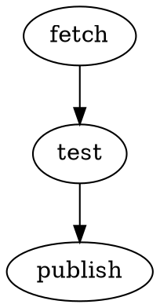

# Kiln Design

**Date:** 2026-03-31
**Status:** Approved

---

## Goal

Build the smallest local orchestrator that can:

- run DAG-defined jobs made of Unix commands
- track workflow runs and node runs durably
- store and expose logs per run
- support human and agent invocation through a stable CLI
- post a periodic status report to Slack

`kiln` is intentionally not a general agent platform, not a daemon, and not a workflow builder UI.

---

## Scope

### In scope for v1

- DOT workflow files stored locally in the repo
- shell-command nodes only
- dependency-based DAG execution
- SQLite-backed run and schedule tracking
- per-node log files on disk
- CLI commands for running, listing, status, logs, retry, scheduling, and reporting
- cron-driven scheduling via `kiln tick`
- 15-minute Slack status report
- a thin agent skill for Codex/Claude usage

### Out of scope for v1

- web UI
- long-running daemon
- remote API server
- dynamic routing / conditional expressions in workflows
- embedded LLM nodes
- multi-tenant auth and credential brokerage

---

## Architecture

`kiln` is a single local Python CLI application with four layers:

1. **Workflow parser** reads a constrained subset of DOT and returns nodes plus dependency edges.
2. **Runtime** executes ready nodes, captures stdout/stderr, and updates run state.
3. **State store** persists workflows, schedules, runs, and node runs in SQLite.
4. **Reporting** renders current state for humans, agents, and Slack.

Scheduling is external and simple:

- cron invokes `kiln tick` on a fixed cadence
- `kiln tick` checks for due workflows, acquires a lock, starts eligible runs, and exits

Slack reporting is also external and simple:

- cron invokes `kiln report --slack` every 15 minutes
- the report command summarizes current and recent state and posts it

---

## Workflow Format

Workflows are DOT files. v1 supports a very small subset:

- directed graph only
- node id plus attributes
- required node attribute: `command`
- optional node attributes: `cwd`, `name`
- edges mean "run target after source succeeds"

Example:

Execution rule:

- a node becomes runnable when all direct predecessors succeeded
- any non-zero exit code marks that node as failed and the run as failed
- downstream nodes do not execute after an upstream failure

---

## Data Model

Primary database path:

- `~/.local/share/kiln/kiln.db`

Primary log root:

- `~/.local/share/kiln/logs/`

Core entities:

- `workflows`
  - `name`
  - `path`
  - `sha256`
  - `created_at`
- `schedules`
  - `workflow_name`
  - `cron_expr`
  - `active`
  - `last_enqueued_at`
- `runs`
  - `id`
  - `workflow_name`
  - `status`
  - `trigger`
  - `started_at`
  - `finished_at`
  - `context_json`
- `node_runs`
  - `run_id`
  - `node_id`
  - `status`
  - `command`
  - `cwd`
  - `log_path`
  - `started_at`
  - `finished_at`
  - `exit_code`

Status vocabulary:

- workflow run: `queued | running | success | failed`
- node run: `pending | running | success | failed | skipped`

---

## CLI Contract

Required commands:

- `kiln run <workflow> [--context key=value]`
- `kiln tick`
- `kiln list`
- `kiln status [--json]`
- `kiln logs <run-id> [node-id]`
- `kiln retry <run-id> [--from-failed]`
- `kiln schedule add <workflow> "<cron-expr>"`
- `kiln report --slack`

Design rules:

- `status --json` must be stable enough for agents
- commands must never require editing DB files directly
- workflow names resolve to files under `workflows/` unless an explicit path is passed

---

## Agent Integration

`kiln` must be callable by both Codex and Claude through the same CLI contract.

Add a project-local skill that tells agents to:

- use `kiln list` before assuming a workflow name
- use `kiln status --json` for machine-readable status checks
- use `kiln logs <run-id>` when investigating failures
- use `kiln retry <run-id> --from-failed` for restart behavior
- never modify SQLite files or log files directly

The skill is advisory only. The orchestrator remains the source of truth.

---

## Slack Reporting

The 15-minute status report should include:

- current in-progress runs
- failures since the last report window
- successes since the last report window
- stale or stuck runs if any are detected

Transport priority:

1. Slack incoming webhook if `KILN_SLACK_WEBHOOK_URL` is set
2. Claude CLI fallback that sends the message to Slack via the local Claude integration

Default target channel for the Claude fallback:

- `#ray-groove-manager`
- channel id `C0AN6F2MUAH`

---

## Operational Model

- `tmux` hosts the interactive development session for the repo
- cron owns recurring execution
- `kiln` itself is a normal short-lived process

Required cron entries:

- `* * * * *` or similar for `kiln tick`
- `*/15 * * * *` for `kiln report --slack`

---

## Testing

v1 must prove:

- DOT workflows parse into the expected DAG
- dependency ordering is correct
- successful and failed node runs are persisted
- log files are written and retrievable
- status and Slack summaries are generated from persisted state

Use Python stdlib where practical to keep setup simple.

---

## Files

Expected top-level project structure:

- `src/kiln/`
- `tests/`
- `workflows/`
- `.codex/skills/kiln/`
- `scripts/`
- `docs/superpowers/specs/`
- `docs/superpowers/plans/`

